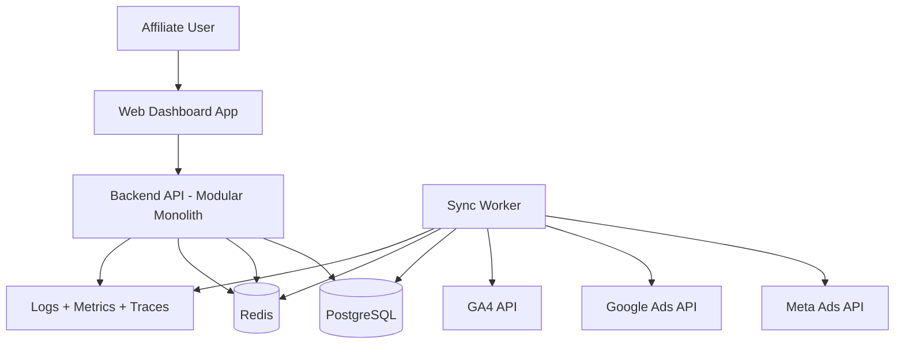
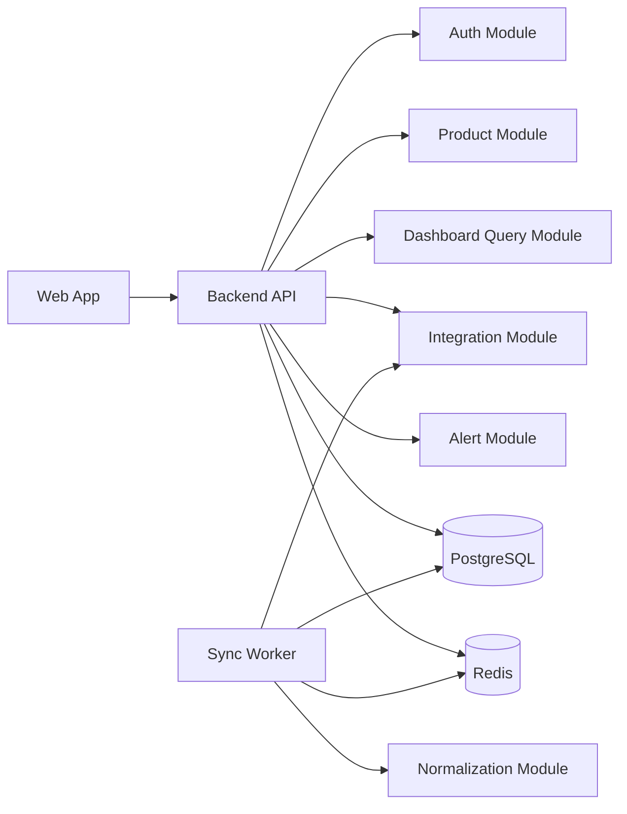
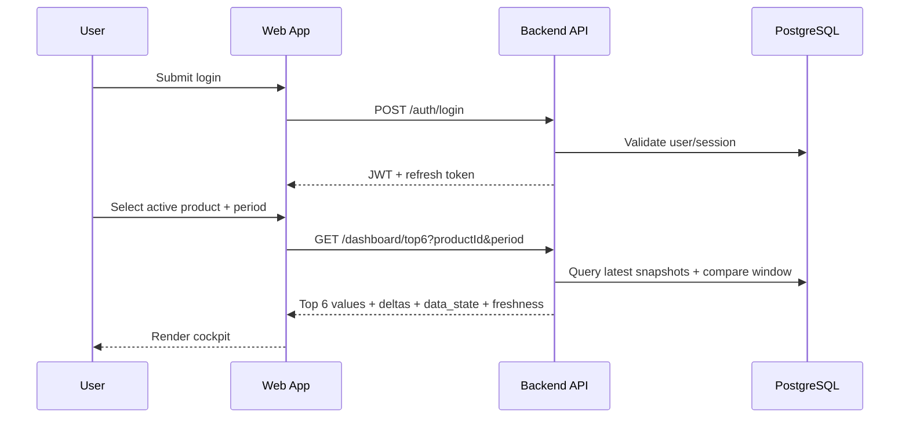
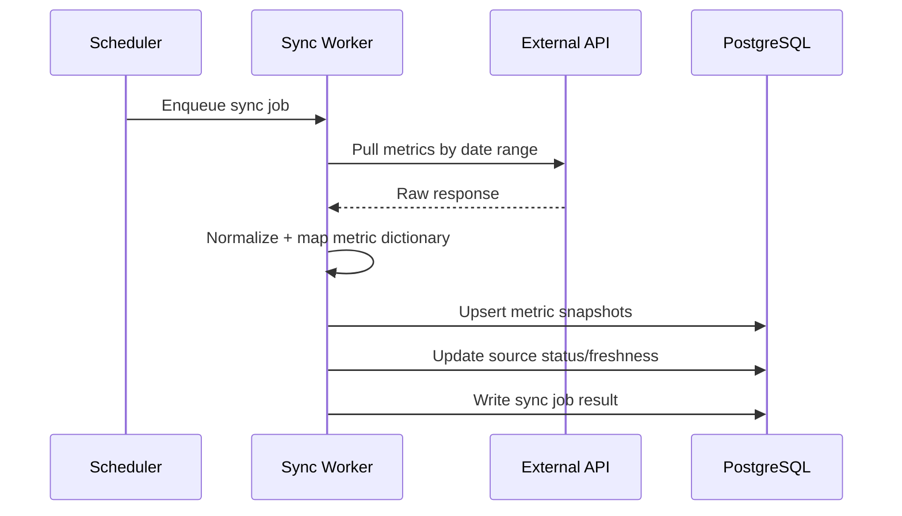
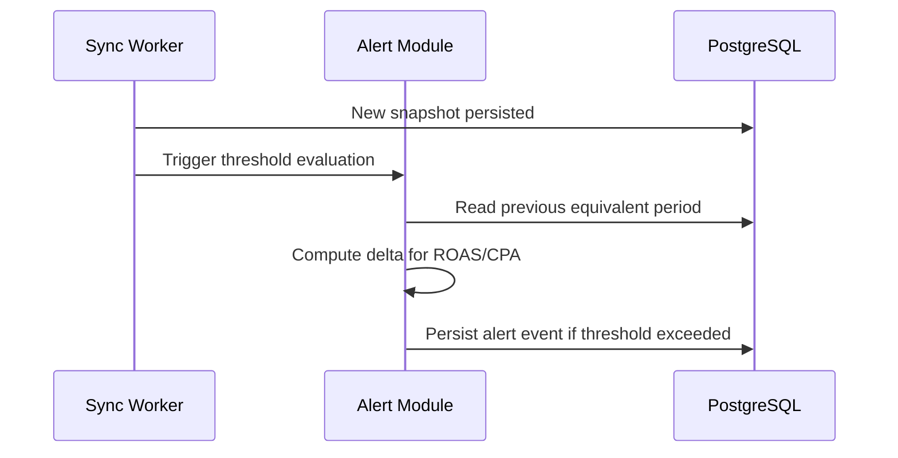

# Painel 747 Architecture Document

## Introduction
This document defines the architecture for Painel 747 with an MVP-first strategy. It is aligned to `docs/prd.md` and specifically to the Hard MVP + Expansion Gate model.

### Starter Template or Existing Project
N/A. Greenfield product architecture from scratch, using a monorepo and modular backend pattern.

### Change Log
| Date | Version | Description | Author |
|------|---------|-------------|--------|
| 2026-03-01 | 0.1 | Initial architecture draft from PRD v1.3 | Architect (Draft by PM handoff) |

## High Level Architecture

### Technical Summary
Painel 747 uses a modular monolith backend plus a web dashboard frontend in a monorepo. The backend exposes a REST API for auth, product context, dashboard queries, and integrations, while a background worker performs API sync and normalization. A relational database stores users, products, connectors, metric definitions, snapshots, and alert events. The architecture is optimized for Hard MVP delivery with one priority source first, then controlled expansion through the Expansion Gate. This design supports fast user insight, clear data freshness signals, and resilient partial-failure behavior.

### High Level Overview
- Architectural style: Modular Monolith + Async Worker
- Repository structure: Monorepo
- Service architecture: One deployable API service + one worker process
- Interaction flow:
  1. User authenticates and selects active product
  2. Dashboard API queries normalized snapshots
  3. Worker syncs source APIs on schedule and updates snapshots/status
  4. UI renders Top 6 metrics, comparison, and critical alerts
- Key decision: keep complexity low in MVP while preserving extension points for additional sources and metrics.

### High Level Project Diagram

### Architectural and Design Patterns
- **Modular Monolith:** Single codebase/deployable unit with strong internal boundaries. _Rationale:_ fastest MVP delivery with manageable operational complexity.
- **Repository Pattern:** Data access abstraction by domain module. _Rationale:_ testability and controlled persistence evolution.
- **Worker + Queue Pattern:** Background sync decoupled from request path. _Rationale:_ avoids blocking user flows on external API latency.
- **Source-of-Truth Metric Registry:** Central metric dictionary and formula ownership. _Rationale:_ consistency across dashboard, deep dive, and alerts.
- **Fail-Soft Read Model:** Partial data can still render cockpit with explicit status. _Rationale:_ operational continuity during source outages.

## Tech Stack

### Cloud Infrastructure
- **Provider:** AWS
- **Key Services:** ECS Fargate (API/Worker), RDS PostgreSQL, ElastiCache Redis, S3 (optional snapshots), CloudWatch
- **Deployment Regions:** us-east-1 (primary)

### Technology Stack Table
| Category | Technology | Version | Purpose | Rationale |
|----------|------------|---------|---------|-----------|
| Language | TypeScript | 5.9.3 | Backend/frontend language | Type safety and consistent dev experience |
| Runtime | Node.js | 20.19.0 | API and worker runtime | Stable LTS runtime |
| Frontend Framework | Next.js | 16.0.0 | Dashboard web app | App routing, strong ecosystem |
| UI Library | React | 19.0.0 | UI composition | Mature component model |
| Backend Framework | NestJS | 11.0.0 | Modular API architecture | Clear module boundaries, DI, testing support |
| API Style | REST | v1 | Client-server contract | Simple MVP integration and observability |
| Database | PostgreSQL | 16.4 | Transactional core data store | Strong relational modeling |
| ORM | Prisma | 6.7.0 | Data access and migrations | Type-safe schema and query layer |
| Cache/Queue | Redis | 7.4 | Caching, queue state, idempotency keys | Low latency and broad tooling |
| Job Queue | BullMQ | 5.40.0 | Sync orchestration and retries | Reliable background jobs with backoff |
| Auth | JWT + Refresh Tokens | n/a | Session/security | Stateless API auth for MVP |
| Validation | Zod | 3.24.0 | Request/contract validation | Runtime validation with TS alignment |
| Testing | Jest | 30.2.0 | Unit/integration tests | Existing project alignment |
| API Docs | OpenAPI | 3.1 | Endpoint documentation | Contract clarity for team and QA |
| Observability | OpenTelemetry SDK | 1.30.0 | Traces/metrics/log context | Faster incident diagnosis |
| CI/CD | GitHub Actions | n/a | Build/test/deploy automation | Standard and maintainable pipeline |

## Data Models

### User
**Purpose:** Authenticated account owner for products and integrations.

**Key Attributes:**
- `id`: uuid - primary key
- `email`: string - unique login identity
- `password_hash`: string - credential hash
- `role`: enum - access role
- `created_at`: timestamp

**Relationships:**
- One user has many products
- One user has many integrations

### Product
**Purpose:** Active analysis context (one product at a time in MVP).

**Key Attributes:**
- `id`: uuid
- `user_id`: uuid
- `name`: string
- `status`: enum
- `created_at`: timestamp

**Relationships:**
- Belongs to one user
- Has many metric snapshots and alerts

### IntegrationSource
**Purpose:** Connected external source configuration (Meta Ads / Google Ads / GA4).

**Key Attributes:**
- `id`: uuid
- `product_id`: uuid
- `source_type`: enum
- `connection_status`: enum (connected, pending, failed)
- `last_sync_at`: timestamp
- `credential_ref`: string (secret manager pointer)

**Relationships:**
- Belongs to one product
- Has many sync jobs

### MetricDefinition
**Purpose:** Canonical metric dictionary and formula metadata.

**Key Attributes:**
- `id`: uuid
- `metric_key`: enum/string (ctr, cpc, cpa, roas, ...)
- `formula_version`: string
- `source_of_truth`: string
- `description`: text

**Relationships:**
- Referenced by metric snapshots
- Referenced by alerts

### MetricSnapshot
**Purpose:** Time-bucketed metric values for cockpit and deep dive.

**Key Attributes:**
- `id`: uuid
- `product_id`: uuid
- `metric_key`: string
- `period_start`: timestamp
- `period_end`: timestamp
- `value`: decimal
- `data_state`: enum (ok, delayed, unavailable)
- `freshness_at`: timestamp

**Relationships:**
- Belongs to product
- Linked to metric definition

### AlertEvent
**Purpose:** Alert records for critical metric deviations.

**Key Attributes:**
- `id`: uuid
- `product_id`: uuid
- `metric_key`: string
- `severity`: enum (critical, warning, info)
- `threshold_value`: decimal
- `delta_percent`: decimal
- `created_at`: timestamp

**Relationships:**
- Belongs to product

### SyncJob
**Purpose:** Track sync execution lifecycle and retry behavior.

**Key Attributes:**
- `id`: uuid
- `integration_source_id`: uuid
- `status`: enum
- `attempt`: int
- `started_at`: timestamp
- `finished_at`: timestamp
- `error_summary`: text

**Relationships:**
- Belongs to integration source

## Components

### Web Dashboard App
**Responsibility:** UI for login, active product selection, Top 6 cockpit, comparisons, alerts, and deep dive MVP.

**Key Interfaces:**
- `GET /api/v1/dashboard/top6`
- `GET /api/v1/dashboard/compare`
- `GET /api/v1/alerts/critical`

**Dependencies:** Backend API

**Technology Stack:** Next.js + React + TypeScript

### API Gateway/Backend API
**Responsibility:** Auth, product context, dashboard read APIs, integration management, and rule-based alert evaluation.

**Key Interfaces:**
- `POST /api/v1/auth/login`
- `POST /api/v1/products`
- `POST /api/v1/integrations/{source}/connect`
- `GET /api/v1/metrics/dictionary`

**Dependencies:** PostgreSQL, Redis, Worker events

**Technology Stack:** NestJS + Prisma + Redis

### Sync Worker
**Responsibility:** Scheduled pull from external APIs, normalization, snapshot persistence, and freshness/status updates.

**Key Interfaces:**
- Queue consumer: `sync.source.requested`
- Internal service interface: `syncSource(productId, sourceType, range)`

**Dependencies:** External APIs, PostgreSQL, Redis queue

**Technology Stack:** Node.js + BullMQ + Nest worker modules

### Observability Layer
**Responsibility:** Central logs, traces, key runtime metrics, and sync health dashboards.

**Key Interfaces:**
- Structured log stream
- Trace exporter

**Dependencies:** API + Worker instrumentation

**Technology Stack:** OpenTelemetry + CloudWatch (or equivalent)

### Component Diagram

## External APIs

### Meta Ads API
- **Purpose:** Campaign delivery/cost/click metrics
- **Documentation:** https://developers.facebook.com/docs/marketing-apis
- **Authentication:** OAuth 2.0 tokens
- **Rate Limits:** Vary by app/account tier

### Google Ads API
- **Purpose:** Campaign performance and spend metrics
- **Documentation:** https://developers.google.com/google-ads/api/docs/start
- **Authentication:** OAuth 2.0 + developer token
- **Rate Limits:** Quota/token based

### Google Analytics 4 Data API
- **Purpose:** Session/page/conversion behavioral metrics
- **Documentation:** https://developers.google.com/analytics/devguides/reporting/data/v1
- **Authentication:** OAuth 2.0 service/user flow
- **Rate Limits:** Property and project quotas

## Core Workflows

### Workflow 1: Login -> Cockpit Top 6

### Workflow 2: Scheduled Sync + Normalization

### Workflow 3: Critical Alert Evaluation

## REST API Spec (MVP)

### Auth
- `POST /api/v1/auth/register`
- `POST /api/v1/auth/login`
- `POST /api/v1/auth/refresh`
- `POST /api/v1/auth/logout`

### Product Context
- `GET /api/v1/products`
- `POST /api/v1/products`
- `PATCH /api/v1/products/{id}/activate`

### Integrations
- `GET /api/v1/integrations`
- `POST /api/v1/integrations/{source}/connect`
- `POST /api/v1/integrations/{source}/reconnect`
- `POST /api/v1/integrations/{source}/revoke`
- `GET /api/v1/integrations/{source}/status`

### Dashboard and Metrics
- `GET /api/v1/dashboard/top6`
- `GET /api/v1/dashboard/compare`
- `GET /api/v1/metrics/dictionary`
- `GET /api/v1/metrics/deep-dive`

### Alerts
- `GET /api/v1/alerts/critical`
- `GET /api/v1/alerts/history`

## NFR Implementation Mapping
- **NFR1/NFR2 (latency):** pre-aggregated snapshots, indexed queries, Redis cache for hot reads.
- **NFR4 (security):** encrypted secrets, TLS-only traffic, scoped tokens.
- **NFR5/NFR6/NFR7 (reliability):** retry/backoff queue strategy, fail-soft rendering, structured incident logs.
- **NFR9 (accessibility):** WCAG AA implementation checklist in frontend acceptance.
- **NFR10 (formula consistency):** single metric dictionary service with versioned formulas.

## Deployment and Environments
- **Environments:** dev, staging, production
- **Deploy units:**
  - `service-api`
  - `service-worker`
- **Database migration strategy:** forward-only versioned migrations
- **Release strategy:** trunk-based with CI quality gates and staged rollout

## Security and Compliance Notes
- Store integration credentials in a secret manager reference model; never persist raw tokens in plain text.
- Keep audit-relevant events for auth, credential changes, sync failures, and alert generation.
- Define retention policy for snapshots and logs to control cost and privacy risk.

## Risks and Architecture Guardrails
- Keep Hard MVP scope fixed until Expansion Gate criteria are met.
- Start with one source connector in production before enabling additional sources.
- Do not enable Fase B metrics by default before Top 6 quality/stability targets are validated.
- Preserve clear mode signaling (Demo vs Real) across all cockpit views.

## Expansion Plan (Post-Gate)
1. Add second and third data sources with same connector contract.
2. Enable Fase B metrics and broaden alert coverage.
3. Introduce advanced formula attribution/audit trails from post-MVP requirements.
4. Scale modular monolith by extracting sync and alert services if throughput demands.
